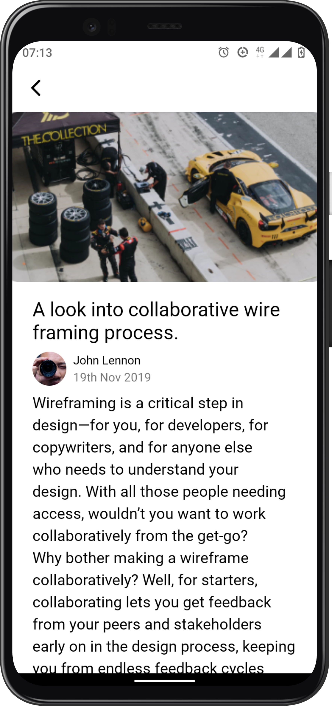
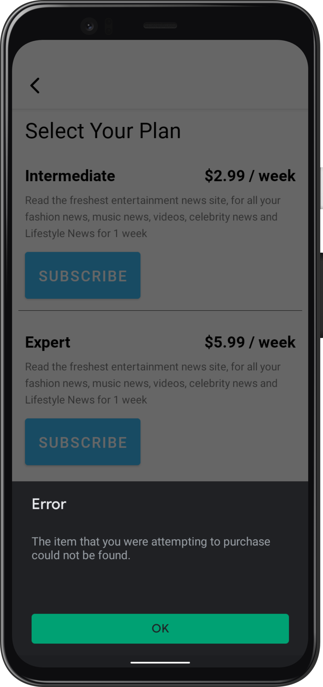

# NewsApp
 A simple android app to display mock news data. 
 
 The app is built using MVVM clean architecture so that when the data source from api is added to the app it can be easily intergrated in the app with minor changes to the app's codebase.

## Prerequisite

- Just add your licencse key which can be generated  the [Google Play Console](https://play.google.com/console/u/0/signup) in the [Constants class](https://github.com/VictorKabata/NewsApp/blob/main/app/src/main/java/com/vickikbt/newsapp/util/Constants.kt)

- Add products that is to be purchased from the app in the Google Play Console and update the product ids in the [Subscription Fragment Class](https://github.com/VictorKabata/NewsApp/blob/main/app/src/main/java/com/vickikbt/newsapp/ui/fragments/SubscriptionFragment.kt)

 ## Libraries

Libraries used in the whole application are:

- [Jetpack](https://developer.android.com/jetpack)🚀
  - [Viewmodel](https://developer.android.com/topic/libraries/architecture/viewmodel) - Manage UI related data in a lifecycle conscious way 
  and act as a channel between use cases and ui
  - [Data Binding](https://developer.android.com/topic/libraries/data-binding) - support library that allows binding of UI components in  layouts to data sources,binds character details and search results to UI
- [okhttp-logging-interceptor](https://github.com/square/okhttp/blob/master/okhttp-logging-interceptor/README.md) - logs HTTP request and response data.
- [Flow](https://developer.android.com/kotlin/flow) - Provides stream api capabilities to your data.
- [kotlinx.coroutines](https://github.com/Kotlin/kotlinx.coroutines) - Library Support for coroutines.
- [Navigation Component](https://developer.android.com/guide/navigation/navigation-getting-started) - Provides simple navigation across the app with fewer boilerplate code.
- [Hilt-Dagger](https://developer.android.com/training/dependency-injection/hilt-android) - Dependency Injection library.
- [Anijab Billing Library](https://github.com/anjlab/android-inapp-billing-v3) - Provides Google billing capabilities with lesser boilerplate code.

## Demo

           

